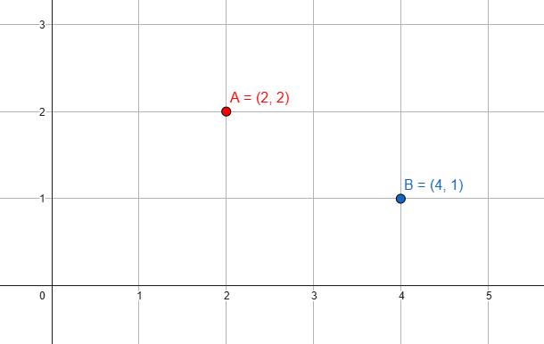
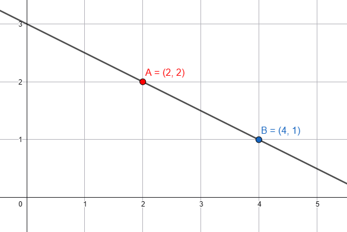

📐 GeoGebra Curriculum (8-Week Program)

Target Grades: 8–10
Schedule: Sundays · 1 hour per week · 8 weeks
Tool: GeoGebra (Classic / Geometry / Graphing)
Level: Beginner → Intermediate
Format: Hands-on exploration + visual math + mini projects

This course helps students see math, not just calculate it.
Every session combines geometry, algebra, trigonometry, and animation using GeoGebra’s interactive tools.

🧠 Learning Goals

By the end of this course, students will be able to:

Confidently use GeoGebra’s UI and tools

Visualize geometry, algebra, and trigonometry concepts

Connect formulas to shapes and motion

Create interactive math models and animations

Design and present a personal GeoGebra project

🗓️ Weekly Curriculum Breakdown
Week 1 — GeoGebra Basics & Interaction
Topics

GeoGebra interface overview

Zoom in/out, grid, axes, settings

Toolbar & mode switching

Points, lines, segments, circles
### Point

### Line

Sliders and basic animation

👉 **Slide - Open in GeoGebra (recommended):**  
https://www.geogebra.org/calculator/cswhastn

Color, style, visibility

Skills

Navigating GeoGebra confidently

Creating simple interactive objects

Example .ggb File

📄 week01_ui_basics.ggb

A draggable triangle

Slider controlling circle radius

Animated point moving along a line

Week 2 — Intersections, Angles & Measurement
Topics

Intersection of objects

Perpendicular & parallel lines

Angles and angle measurement

Area calculation

Introduction to π (pi)

Skills

Measuring and reasoning with geometry

Understanding relationships between shapes

Example .ggb File

📄 week02_intersection_angle_area.ggb

Two intersecting lines with dynamic angles

Rectangle with area displayed

Circle showing diameter → π relationship

Week 3 — Triangles & Pythagorean Theorem
Topics

Triangle types

30-60-90 and 45-45-90 triangles

Triangle angle sum

Area of triangles

Pythagorean Theorem (visual proof)

Skills

Connecting triangle geometry to formulas

Visual reasoning instead of memorization

Example .ggb File

📄 week03_triangles_pythagorean.ggb

Adjustable right triangle

Squares on each side (a² + b² = c²)

Sliders to explore special triangles

Week 4 — Circles, Unit Circle & Radians
Topics

Circle properties

Unit circle

Degrees vs radians

Arc length

Circumference

π through circle animation

Skills

Understanding radians visually

Linking angles to arc length

Example .ggb File

📄 week04_unit_circle_radian.ggb

Rotating point on unit circle

Angle slider (degrees ↔ radians)

Arc length highlighted dynamically

Week 5 — Linear Functions
Topics

Coordinate plane

Linear equations

Slope (rate of change)

x-intercept & y-intercept

Solving linear systems (visual)

Skills

Interpreting graphs

Understanding slope as motion

Example .ggb File

📄 week05_linear_functions.ggb

Line controlled by slope & intercept sliders

Two lines intersecting (solution point shown)

Week 6 — Quadratic Functions
Topics

Quadratic equations

Parabolas

Vertex

Roots / x-intercepts

Effect of coefficients

Skills

Seeing how equations shape graphs

Exploring cause-and-effect visually

Example .ggb File

📄 week06_quadratic_functions.ggb

Parabola with sliders for a, b, c

Vertex and roots automatically displayed

Week 7 — Trigonometry & Motion (Solar System)
Topics

Sine, cosine, tangent

## 🔗 Live Interactive GeoGebra File

👉 **Slide - Open in GeoGebra (recommended):**  
https://www.geogebra.org/m/a5bzju5p

  <iframe src="https://www.geogebra.org/calculator/cswhastn?embed"
          width="800"
          height="600"></iframe>

Angle-based motion

Circular motion

Intro to modeling real systems

Skills

Applying trigonometry to motion

Using math to simulate reality

Example .ggb File

📄 week07_solar_system.ggb

Sun at center

Planets orbiting using sin & cos

Adjustable orbital speed and radius

Week 8 — Personal Project & Presentation
Topics

Project planning

Design & refinement

Presentation & explanation

Project Ideas

Custom solar system

Animated trigonometry demo

Interactive geometry puzzle

Physics-style motion simulation

Creative math art

Skills

Independent thinking

Explaining math concepts clearly

Creative problem-solving

Example .ggb File

📄 week08_personal_project.ggb

Student-designed project

Must include:

At least one slider

One animation

One mathematical explanation